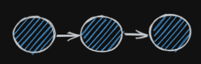

# Commits

* A commit is a snapshot of a project at a specific point in time.
* Think of it as a `save point` in a video game. If/When you mess up your project you can go back to a working commit.
* Usually contains a logical set of changes, e.g. one feature added. 
* Can be thought of as being along a timeline. 

*Bonus Information :* Commits do not have to be code, you can commit anything, and use git to version control any kind of file. 