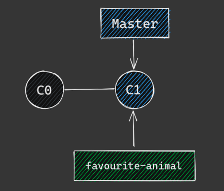
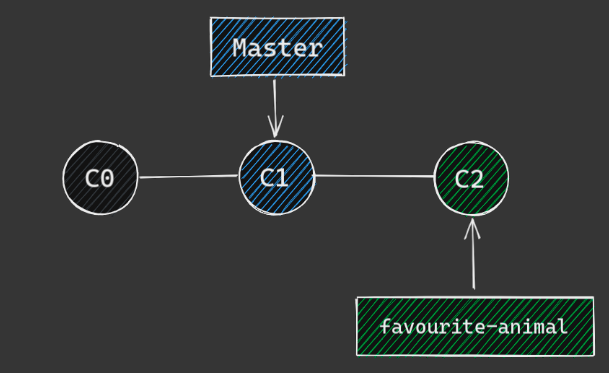

# Practical Branches

To view existing branches 
```sh
$ git branch
```

Now lets create our first new branch
```sh
$ git branch favourite-animal
```

This is what our branches look like now


Now lets create our second branch
```sh
$ git branch favourite-show
```

To view our branches again
```sh
$ git branch -v
```

Next we want to switch to one of our new branches
```sh
$ git checkout favourite-animal
```

Okay time to make some changes.
```sh
echo 'my favourite animal is a <your-favourite-animal>' > animal.txt
```

To add this change to staging, same as before
```sh
$ git add animal.txt
```

And last lets commit that change 
```sh
$ git commit -m "Add my favourite animal"
```

This is what our branches look like now after the latest commit


To view existing branches 
```sh
$ git branch -v
```

Now switch the your other branch
```sh
$ git checkout favourite-show
```

Lets get some changes done on this branch
```sh
$ echo 'my favourite show is <your-favourite-show>' > show.txt
$ git add show.txt
$ git commit -m 'add my favourite show
```


