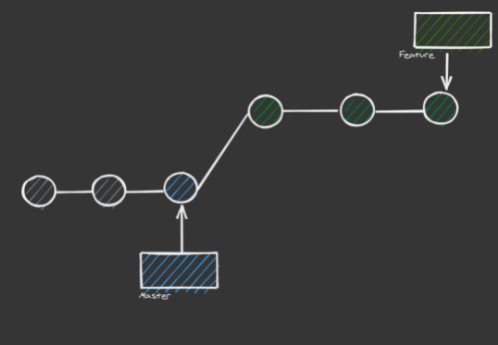

# Fast-forward Merging

* This is the simplest form of merging
* This is the default way that git will merge when the target branch is an ancestor of the source branch
* In other words there is a linear path from the current master branch to the tip of the feature branch

