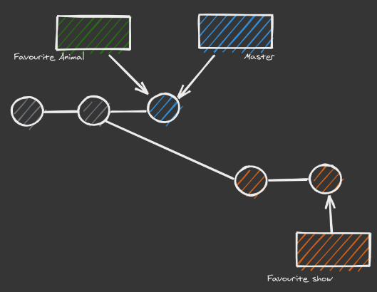
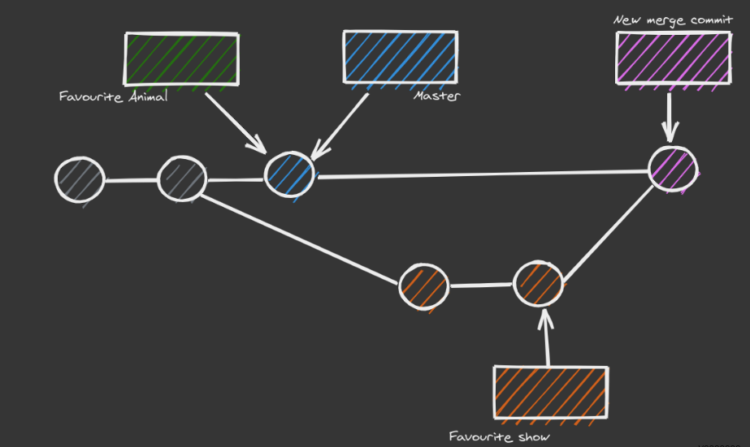

# Merge Commits

* When the target branch is not a direct ancestor of the source branch
  * There is no linear flow between master and feature
* We create a new merge commit
  * Unique in that they have two parent commits
* Git will attempt to auto merge the histories
  * If there is an issue (conflict) Git will need user intervention to continue.

