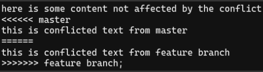

How is a conflict presented?

* When Git encounters a conflict, it will edit the content of the affected files.
* Using visual indicators that mark both sides of the conflicted context.
* Once you identified conflicting sections, you can go in and fix them up to your liking.

