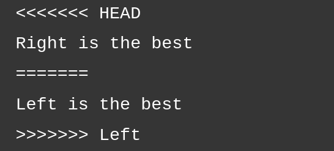

# Practical Conflict

Start by checking out master 
```sh
$ git checkout master
```

Now create a new branch and add a file
```sh
$ git checkout -b left master
$ echo "left is the best" > conflict.txt
$ git add conflict.txt
$ git commit -m "left is the best"
```

Now create another new branch and add the same file with different content
```sh
$ git checkout -b right master
$ echo "right is the best" > conflict.txt
$ git add conflict.txt
$ git commit -m "rights is the best"
```

Now lets merge our left branch into our right branch
```sh
$ git merge left
```

Oh no, we have a conflict, Git has stopped the merge, and asked us to resolve 
```sh
$ git status
```

Open conflict.txt


Fix the conflict, by updating conflict.txt
```sh
Right and Left are both equally good
```

Add the new file changes
```sh
$ git add conflict.txt
```

Check the status once more
```sh
$ git status
```

Now to finish merge and resolve the commit, simply run
```sh
$ git commit
```
