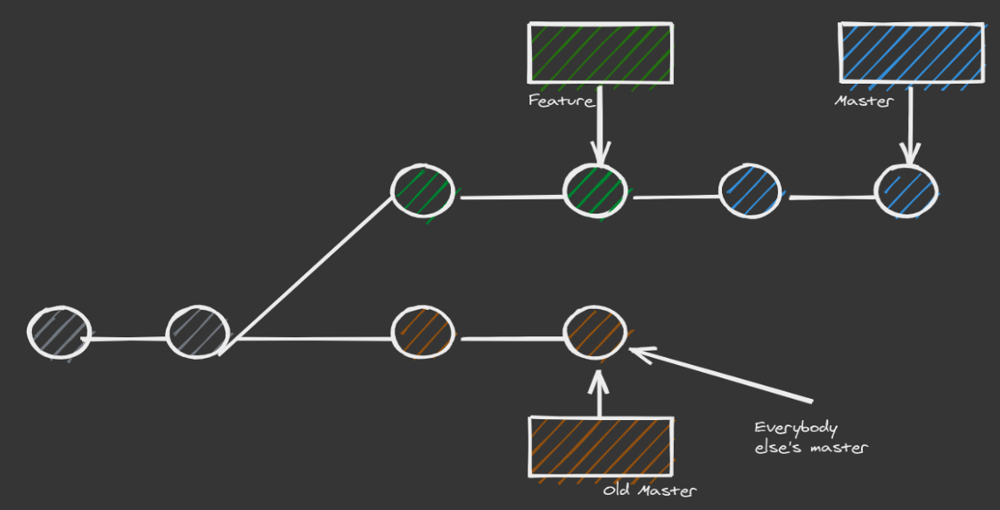

# The Golden Rule 

* Now we know what rebasing is, it is important to to learn when not to do it.
* The rule is never rebase a public branch
* If you rebased a public branch, you will move all the commits in master to the tip of your feature branch. 
* Everyone else will be looking at the old master commit, you will have diverged
* Merging a diverged branch will mean extra merge commits and commits that contain the same changes 
* The original and the diverged change

